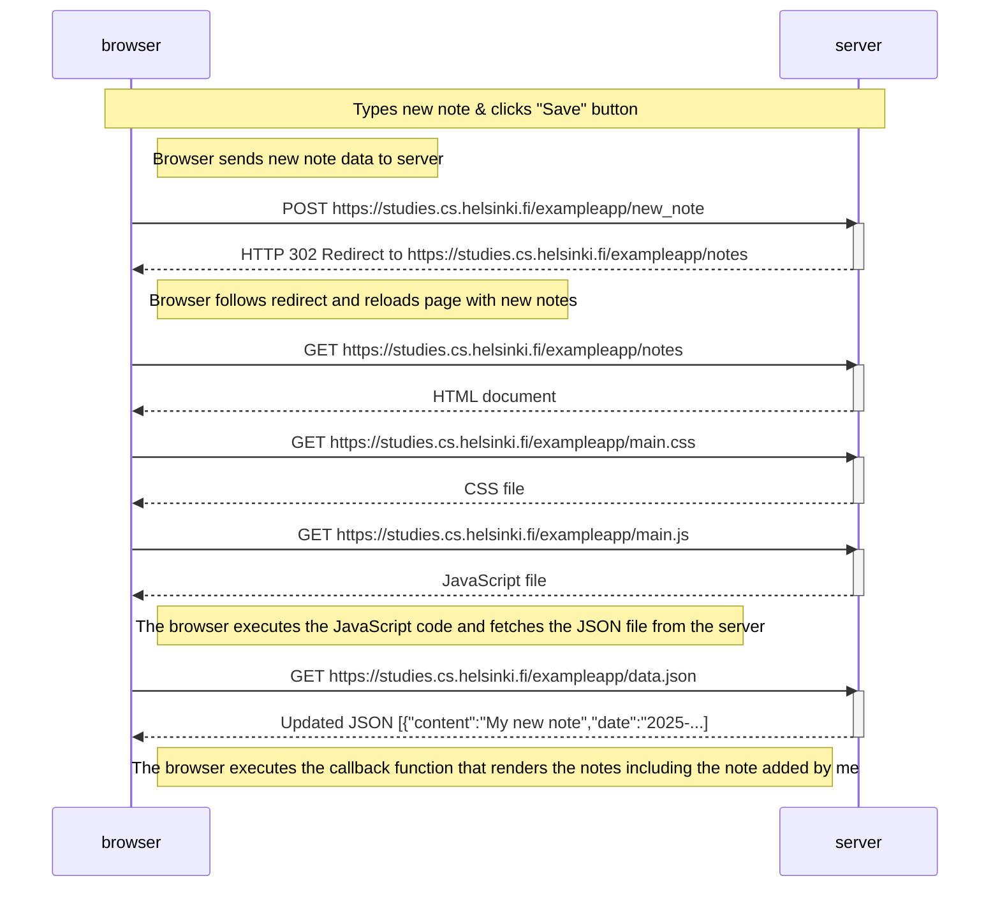

```mermaid
sequenceDiagram
    participant browser
    participant server

    Note over browser,server: Types new note & clicks "Save" button
    Note right of browser: Browser sends new note data to server

    browser->>server: POST https://studies.cs.helsinki.fi/exampleapp/new_note
    activate server
    server-->>browser: HTTP 302 Redirect to https://studies.cs.helsinki.fi/exampleapp/notes
    deactivate server

    Note right of browser: Browser follows redirect and reloads page with new notes

    browser->>server: GET https://studies.cs.helsinki.fi/exampleapp/notes
    activate server
    server-->>browser: HTML document
    deactivate server

    browser->>server: GET https://studies.cs.helsinki.fi/exampleapp/main.css
    activate server
    server-->>browser: CSS file
    deactivate server

    browser->>server: GET https://studies.cs.helsinki.fi/exampleapp/main.js
    activate server
    server-->>browser: JavaScript file
    deactivate server

    Note right of browser: The browser executes the JavaScript code and fetches the JSON file from the server

    browser->>server: GET https://studies.cs.helsinki.fi/exampleapp/data.json
    activate server
    server-->>browser: Updated JSON [{"content":"My new note","date":"2025-...]
    deactivate server
    Note right of browser: The browser executes the callback function that renders the notes including the note added by me
```