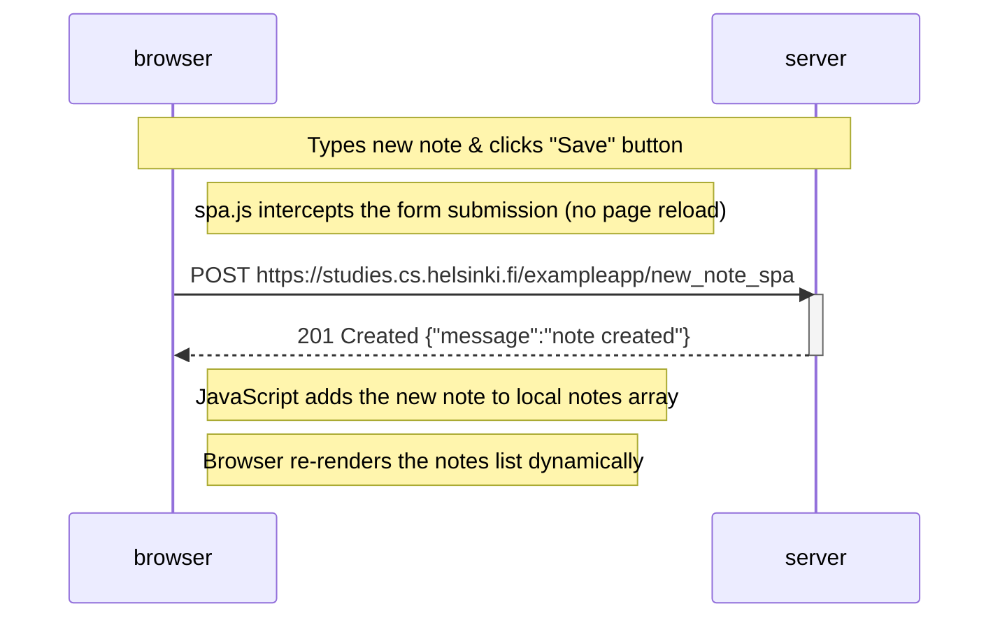

```mermaid
sequenceDiagram
    participant browser
    participant server

    Note over browser,server: Types new note & clicks "Save" button
    
    Note right of browser: spa.js intercepts the form submission (no page reload)

    browser->>server: POST https://studies.cs.helsinki.fi/exampleapp/new_note_spa
    activate server
    server-->>browser: 201 Created {"message":"note created"}
    deactivate server
    
    Note right of browser: JavaScript adds the new note to local notes array
    Note right of browser: Browser re-renders the notes list dynamically
```